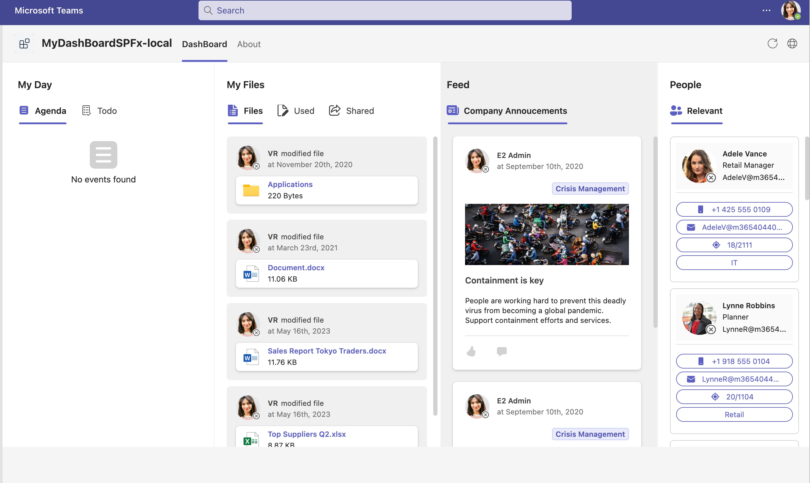

# SPFx (SharePoint Framework) App

## Summary

The SharePoint Framework (SPFx) is a page and web part model that provides full support for client-side SharePoint development, easy integration with SharePoint data, and extending Microsoft Teams. This project applies SPFx to Teams personal tab and group tab support.

## Applies to

- [SharePoint Framework](https://aka.ms/spfx)
- [Microsoft 365 tenant](https://docs.microsoft.com/en-us/sharepoint/dev/spfx/set-up-your-developer-tenant)

## Prerequisites

> - [Set up SharePoint Framework development environment](https://aka.ms/teamsfx-spfx-dev-environment-setup)
> - An Microsoft 365 account. Get your own free Microsoft 365 tenant from [Microsoft 365 developer program](https://developer.microsoft.com/en-us/microsoft-365/dev-program)
> - [Teams Toolkit Visual Studio Code Extension](https://aka.ms/teams-toolkit) version 5.0.0 and higher or [TeamsFx CLI](https://aka.ms/teamsfx-cli)

## Solution

Solution|Author(s)
--------|---------
app-my-dashboard-spfx | João Mendes

## Version history

Version|Date|Comments
-------|----|--------
1.0|August 28, 2023|Initial release

## Disclaimer

**THIS CODE IS PROVIDED *AS IS* WITHOUT WARRANTY OF ANY KIND, EITHER EXPRESS OR IMPLIED, INCLUDING ANY IMPLIED WARRANTIES OF FITNESS FOR A PARTICULAR PURPOSE, MERCHANTABILITY, OR NON-INFRINGEMENT.**

---

## Minimal Path to Awesome

1. Open the project with VSCode, click `Provision` in LIFECYCLE panel of Teams Toolkit extension.

    Or you can use TeamsFx CLI with running this cmd under your project path:
    `teamsfx provision`

    It will provision an app in Teams App Studio. You may need to login with your Microsoft 365 tenant admin account.

2. Build and Deploy your SharePoint Package.
    - Click `Deploy` in LIFECYCLE panel of Teams Toolkit extension, or run `Teams: Deploy` from command palette. This will generate a SharePoint package (*.sppkg) under sharepoint/solution folder.
  
    Or you can use TeamsFx CLI with running this cmd under your project path:
        `teamsfx deploy`

    - After building the *.sppkg, the Teams Toolkit extension will upload and deploy it to your tenant App Catalog. Only tenant App Catalog site admin has permission to do it. You can create your test tenant following [Setup your Microsoft 365 tenant](https://docs.microsoft.com/en-us/sharepoint/dev/spfx/set-up-your-developer-tenant).
3. Go back to Teams Toolkit extension, click `Teams: Publish` in LIFECYCLE panel.

    Or you can use TeamsFx CLI with running this cmd under your project path:
        `teamsfx publish`

    You will find your app in [Microsoft Teams admin center](https://admin.teams.microsoft.com/policies/manage-apps). Enter your app name in the search box. Click the item and select `Publish` in the Publishing status.

4. You may need to wait for a few minutes after publishing your teams app. And then login to Teams, and you will find your app in the `Apps - Built for {your-tenant-name}` category.

5. Click "Add" to use the app as a personal tab. Click "Add to a team" to use the app as a group tab.

## Debug

Start debugging the project by hitting the `F5` key in Visual Studio Code. Alternatively use the `Run and Debug Activity Panel` in Visual Studio Code and click the `Start Debugging` green arrow button.

- `Teams workbench` is the default debug configuration. Using this configuration, you can install the SPFx app within Teams context as a Teams app.
- `Hosted workbench`. You need to navigate to [launch.json](../.vscode/launch.json), replace `enter-your-SharePoint-site` with your SharePoint site, eg. `https://{your-tenant-name}.sharepoint.com/sites/{your-team-name}/_layouts/workbench.aspx`. You can also use root site if you haven't created one, eg. `https://{your-tenant-name}.sharepoint.com/_layouts/workbench.aspx`.

## References

- [Getting started with SharePoint Framework](https://docs.microsoft.com/en-us/sharepoint/dev/spfx/set-up-your-developer-tenant)
- [Building for Microsoft teams](https://docs.microsoft.com/en-us/sharepoint/dev/spfx/build-for-teams-overview)
- [Use Microsoft Graph in your solution](https://docs.microsoft.com/en-us/sharepoint/dev/spfx/web-parts/get-started/using-microsoft-graph-apis)
- [Publish SharePoint Framework applications to the Marketplace](https://docs.microsoft.com/en-us/sharepoint/dev/spfx/publish-to-marketplace-overview)
- [Microsoft 365 Patterns and Practices](https://aka.ms/m365pnp) - Guidance, tooling, samples and open-source controls for your Microsoft 365 development

