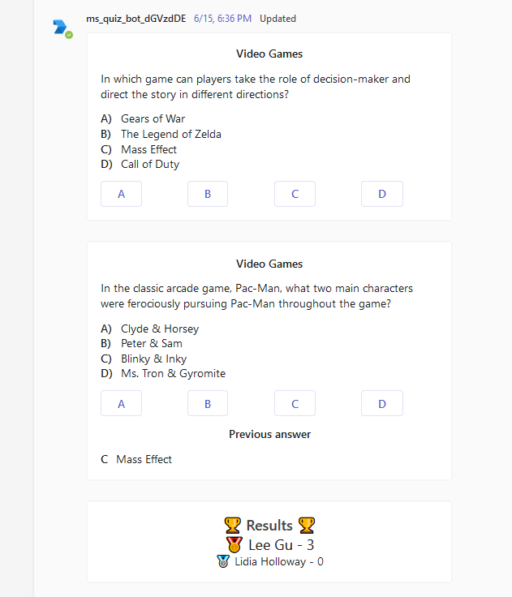

# MsTeams Quiz Bot

## Summary

MsTeams Quiz Bot is a Microsoft Teams bot that allows users to create quizzes on any subject using randomly generated questions.

When mentioned with `@bot-name quiz`, the bot creates an adaptive card that enables users to set up a quiz about a specific topic and in their preferred language. The user initiating the quiz has full control to participate, lock a question, generate the next question, and stop the quiz to view the top results.



https://user-images.githubusercontent.com/126659601/246180922-01173cba-c3f4-4846-b722-6e1aa31cc17c.mp4

## Frameworks


## Prerequisites


* [Office 365 tenant](https://dev.office.com/sharepoint/docs/spfx/set-up-your-development-environment)
* [A registered Microsoft Bot](https://dev.botframework.com/bots/new)
* [Azure Functions App](https://learn.microsoft.com/en-us/azure/azure-functions/functions-create-function-app-portal)<sup>1</sup>
* [Azure Cosmos Database](https://learn.microsoft.com/en-us/azure/cosmos-db/nosql/quickstart-portal)<sup>1</sup>
* [Visual Studio 2022](https://visualstudio.microsoft.com/vs/) with .NET 6.0
* Tunneling service<sup>2</sup>
  * [Visual Studio Dev Tunnels](https://learn.microsoft.com/en-us/connectors/custom-connectors/port-tunneling)
  * [Ngrok](https://learn.microsoft.com/en-us/microsoftteams/platform/concepts/build-and-test/debug#locally-hosted)
* OpenAi account and [api key](https://platform.openai.com/account/api-keys)

<sup>1</sup> Not required for local testing<br>
<sup>2</sup> Only required running locally

## Version history

Version|Date|Author|Comments
-------|----|----|--------
1.0|July 13, 2023|Marcel Paalvast|Initial release

## Disclaimer

**THIS CODE IS PROVIDED *AS IS* WITHOUT WARRANTY OF ANY KIND, EITHER EXPRESS OR IMPLIED, INCLUDING ANY IMPLIED WARRANTIES OF FITNESS FOR A PARTICULAR PURPOSE, MERCHANTABILITY, OR NON-INFRINGEMENT.**

---

## Minimal Path to Awesome

Steps to debug the application:

* Create an app using the `Developer Portal` from Teams
  * In App Features add your bot
  * In App Features select the scopes `Personal, Teams & Group Chat`
* Obtain an [OpenAi api key](https://platform.openai.com/account/api-keys)
* Create a Cosmos Database<sup>1</sup>
  * Create a Cosmos Container<sup>2</sup>
  * Take note of the key and endpoint in Azure Portal
* Clone this repository
* Open the solution in Visual Studio
* Create a (persistent public) Dev Tunnel from Visual Studio and note the endpoint
* Change the endpoint of your [registered bot](https://dev.botframework.com/bots)
  * Use the following format: `https://<YourDevTunnel>.devtunnels.ms/api/messages`
* Create a `local.settings.json` using the format below
* Run the project in Visual Studio
* Mention the bot<sup>3</sup> in Teams using `@<name of your bot> quiz`


<sup>1</sup> The database may run serverless or using provisioned throughput using default values<br>
<sup>2</sup> Use default values<br>
<sup>3</sup> Autocomplete should suggest the bot name

#### local.settings.json
```json
{
  "IsEncrypted": false,
  "Values": {
    "AzureWebJobsStorage": "UseDevelopmentStorage=true",
    "FUNCTIONS_WORKER_RUNTIME": "dotnet",
    "MicrosoftAppType": "MultiTenant",
    "MicrosoftAppId": "<bot app id>",
    "MicrosoftAppPassword": "<bot password>",
    "Cosmos:Endpoint": "<endpoint uri>",
    "Cosmos:Key": "<access key>",
    "Cosmos:Database": "<database name>",
    "Cosmos:Container": "<container name>",
    "OpenAi:ApiKey": "<openai api key>"
  }
}
```

## Features

  A Function App acts as an API for the bot framework endpoint to receive and process incoming messages. The app interacts with users through [Microsoft's Adapative Cards](https://adaptivecards.io/).

  Questions are generated using OpenAi's ChatGpt based on the topic and language provided by the user starting the quiz.
  
  The app's state is saved in a Cosmos Database, allowing the Function App to pause or scale out to multiple instances without affecting quizzes in progress. When the Function App remains running, a memory cache is used to retrieve data without accessing the Cosmos Database.

