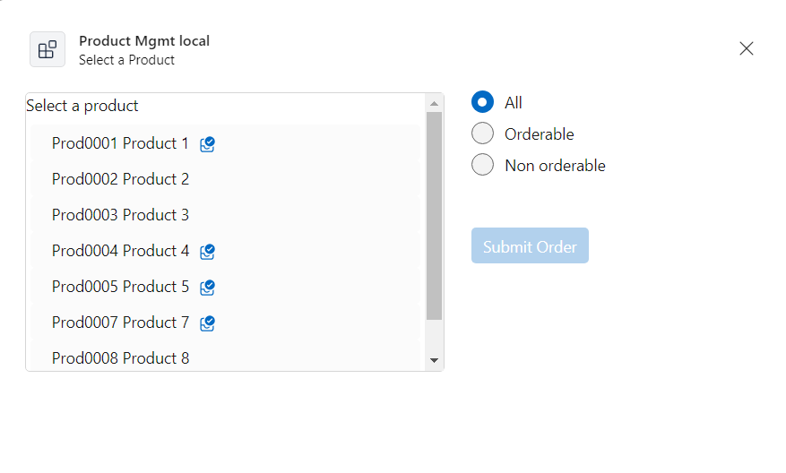
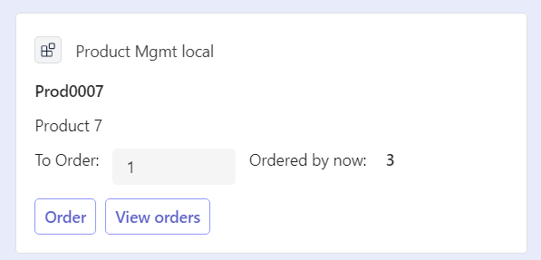
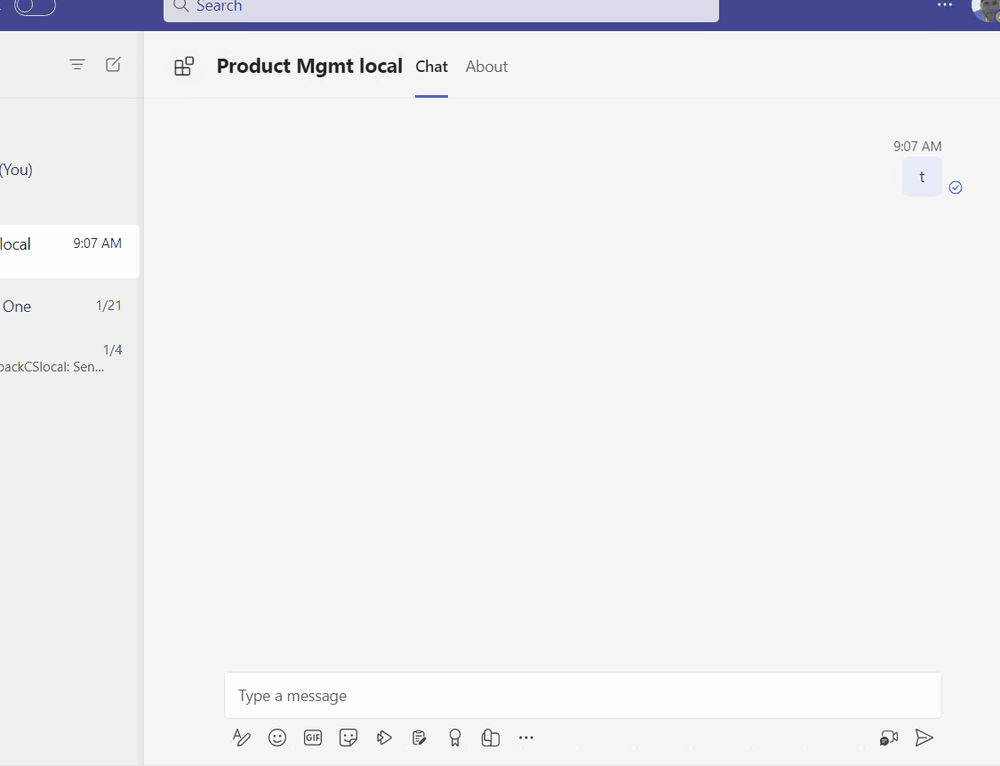
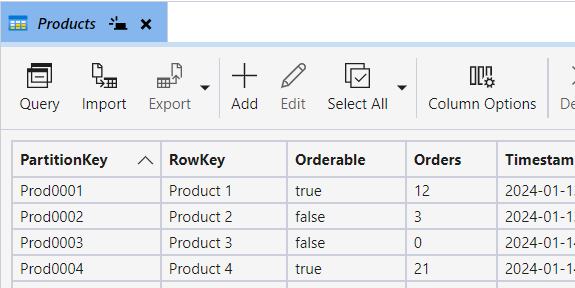

# msgext action search data - Microsoft 365 App
Teams/M365 messaging extension app handling (action-based) data retrieval and writing back

## Summary
This sample is an action-based Teams and M365 Messaging Extension app created using the Teams Toolkit with Visual Studio 2022. It is also intended to be used in Copilot.
It retrieves a list of products to be further dealt with: Overview listed, order e.g. while all sent with Adaptive Cards in Teams or Outlook, resp Copilot ...

App result:

|Task Module to select a product|
:-------------------------:


|Order Card result|
:-------------------------:


|Order Card result in Oùtlook with weekday order option|
:-------------------------:


|App in action|
:-------------------------:



For further details see the author's [blog post](https://mmsharepoint.wordpress.com/2024/01/31/an-action-based-teams-and-m365-messaging-extension/)

## Frameworks


## Prerequisites

* [Office 365 tenant](https://dev.office.com/sharepoint/docs/spfx/set-up-your-development-environment)

## Applies to

This sample was created  [using the Teams Toolkit with Visual Studio 2022](https://learn.microsoft.com/en-us/microsoftteams/platform/toolkit/toolkit-v4/teams-toolkit-fundamentals-vs?WT.mc_id=M365-MVP-5004617). Nearly the same [sample](https://github.com/pnp/teams-dev-samples/samples/msgext-action-search-data-node) was also realized [using the Teams Toolkit with Visual Studio Code](https://learn.microsoft.com/en-us/microsoftteams/platform/toolkit/teams-toolkit-fundamentals?WT.mc_id=M365-MVP-5004617).


## Version history

Version|Date|Author|Comments
-------|----|--------|--------
1.0|April 01, 2024|[Markus Moeller](http://www.twitter.com/moeller2_0)|Initial release

## Disclaimer

**THIS CODE IS PROVIDED *AS IS* WITHOUT WARRANTY OF ANY KIND, EITHER EXPRESS OR IMPLIED, INCLUDING ANY IMPLIED WARRANTIES OF FITNESS FOR A PARTICULAR PURPOSE, MERCHANTABILITY, OR NON-INFRINGEMENT.**

---
## Minimal Path to Awesome
- Clone the repository
    ```bash
    git clone https://github.com/pnp/teams-dev-samples.git
- Open /samples/msgext-action-search-data/msgext-action-search-data.sln in Visual Studio 2022
- Perform first actions in GettingStarted.txt (before hitting F5)
- Now you should have prepared your app (will try local first)
- 
- Create an Azure Data Table and put account name and insert AZURE_CONFIG_CONNECTION_STRING, AZURE_TABLE_ACCOUNTNAME and AZURE_TABLE_KEY to appsettings.json or better appsettings.Development.json 



- When starting debug by F5 or "Microsoft Teams (browser)"
  

## Features

* [Build Action-Based M365 Messaging Extensions for Teams, Outlook and Copilot](https://learn.microsoft.com/en-us/microsoftteams/platform/m365-apps/extend-m365-teams-message-extension?tabs=ttk%2Caction-based-message-extension&WT.mc_id=M365-MVP-5004617)
* [Build Task Modules for Bots and Messaging Extensions](https://learn.microsoft.com/en-us/microsoftteams/platform/task-modules-and-cards/what-are-task-modules?WT.mc_id=M365-MVP-5004617)
* [Use Blazor in .Net6 Web App](https://learn.microsoft.com/en-us/aspnet/core/blazor/?view=aspnetcore-6.0&WT.mc_id=M365-MVP-5004617)
* Data Storage and retrieval in [Azure Tables](https://learn.microsoft.com/en-us/dotnet/api/overview/azure/data.tables-readme?view=azure-dotnet&WT.mc_id=M365-MVP-5004617)
 

