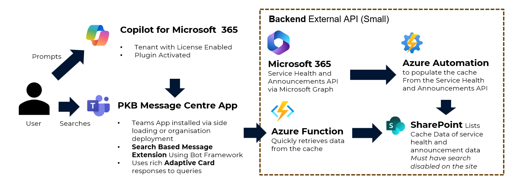

# Tenant Health Messages and Announcements for Copilot for Microsoft 365

Demo app that shows how to use a Teams Message extension and extend to Copilot for Microsoft 365. This app uses the Microsoft 365 Tenant Service Health and Announcements API to get the data and display it in the Teams Message extension.


## Summary

This application is generated using Teams Toolkit, calling an API that provides the Microsoft 365 Tenant Service Health and Announcements data cached in SharePoint lists. The app is then extended to Copilot for Microsoft 365, adapting to multiple command parameters and semantic descriptions to provide a better user experience.

When the app is operational, you will see the following in the Teams Message Extension and Copilot for Microsoft 365:

**Video Example:**


> *Note: Portions of the video have been speed up for brevity.*

## Tools and Frameworks


- PnP PowerShell (v2.4) used for Azure Functions and Azure Automation.

## Prerequisites

The architecture of the app is as follows:



> Note: for now parts of the setup are manual, please follow [the setup guide](docs/setup.md) for the backend service and the SharePoint list.

## Key Areas of focus when extending Copilot for Microsoft 365

- Update your application to the latest manifest version (1.17 or higher) to support Copilot for Microsoft 365.
- Application, Command & Command Parameter Descriptions ensuring that the app is clear and concise in what it does, the purpose of the app, and the data that it will access. Copilot will assess this and determine if the app will be used in the response. There is a `semanticDescriptions` property in the manifest that can be used to provide this information for the LLM.
- You can use more than one command parameter for Copilot recommended 3 up to 5.
- Ensure the application will respond in less than 6 seconds to Copilot requests.
- You will need a **Copilot for Microsoft 365 license** to test the app - however to test the Teams extension without Copilot, you will not need this license.


## Version history

Version|Date|Author|Comments
-------|----|----|--------
1.0 | May 19, 2024 | Paul Bullock |Initial release

## Disclaimer

**THIS CODE IS PROVIDED *AS IS* WITHOUT WARRANTY OF ANY KIND, EITHER EXPRESS OR IMPLIED, INCLUDING ANY IMPLIED WARRANTIES OF FITNESS FOR A PARTICULAR PURPOSE, MERCHANTABILITY, OR NON-INFRINGEMENT.**

---

## Minimal Path to Awesome

> Note: for now parts of the setup are manual, please follow [the setup guide](docs/setup.md) for the backend service and the SharePoint list.

* Clone this repository
* Open the cloned copy of this folder with Visual Studio Code
* Use the env sample environment files are renamed to remove the `.sample` extension and update the values to match your environment - most will be generated by Teams Toolkit.
* Install required npm packages

```shell
  npm install
```

* Press F5 to run the application. A browser window should open offering to add your application to Microsoft Teams.


## Features

Additional features include:

- Supporting the app is an Azure Function that is used to get the data from the Microsoft 365 Tenant Service Health and Announcements API - this is simulating the backend service that would be used in a production app.
- This includes use of SharePoint lists for caching the service health and announcements data for faster retrieval.
- Adaptive Cards to present the information clearly to the user and to Copilot
- Includes semantic descriptions for Copilot for Microsoft 365 to understand the purpose of the app and the data it will access.

## Useful Resources

- [Overview of Message Extension Bots | Microsoft Learn](https://learn.microsoft.com/en-us/microsoft-365-copilot/extensibility/overview-message-extension-bot?WT.mc_id=M365-MVP-5003816 
)
- [Build High Quality Message Extensions | Microsoft Learn](https://learn.microsoft.com/en-us/microsoftteams/platform/messaging-extensions/high-quality-message-extension?WT.mc_id=M365-MVP-5003816 
)
- [Microsoft 365 Copilot and AI Resources | pkbullock.com](https://pkbullock.com/blog/2023/m365-copilot-and-ai-resources)
- [Microsoft Adoption Copilot Samples | Microsoft](https://adoption.microsoft.com/en-us/sample-solution-gallery/?keyword=&sort-by=updateDateTime-true&page=1&product=Microsoft+365+Copilot&WT.mc_id=M365-MVP-5003816)
- [Microsoft Learn Module – Optimize and extend Copilot for Microsoft 365
](https://learn.microsoft.com/en-us/training/modules/optimize-and-extend-microsoft-365-copilot?WT.mc_id=M365-MVP-5003816 
)

- [Service Health and Announcements API | Microsoft Graph Documentation](https://learn.microsoft.com/en-us/graph/api/resources/service-communications-api-overview?view=graph-rest-1.0)


----