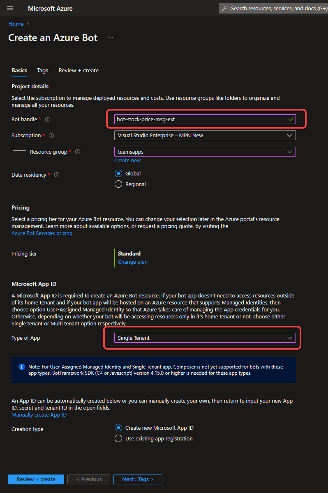
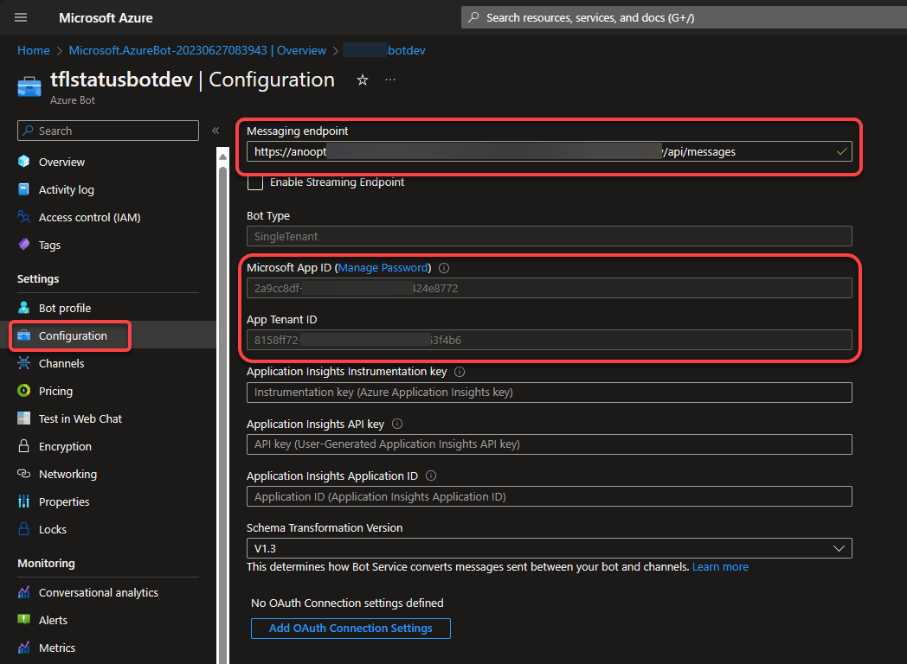
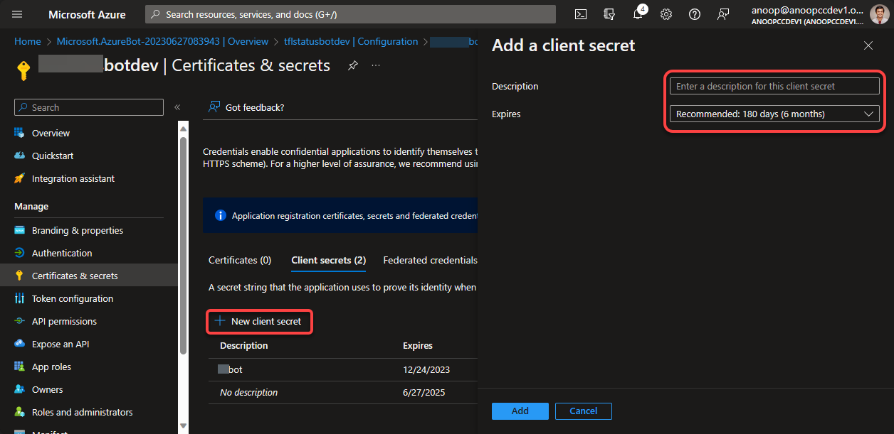
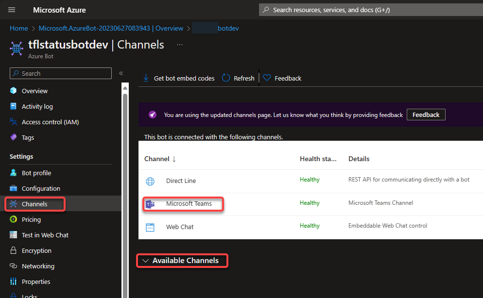

# Teams OpenAI Stock Price Message Extension

## Summary

- This sample is a message extension for Microsoft Teams that provides information about the stock price of a company. 
- The information is based on the response from Finnhub. 
- The information exchanged between the user and the message extension is in natural language. 
- The message extension uses [OpenAI's function calling feature](https://openai.com/blog/function-calling-and-other-api-updates) to understand whether a function in the code needs to be called based on user's query. 
- The message extension calls OpenAI API which transforms the JSON reponse from [Finnhub API](https://finnhub.io/) to natural language.


## Further details
- This sample shows how use [OpenAI's function calling feature](https://openai.com/blog/function-calling-and-other-api-updates). A Teams message extension is used to show this feature in action. 
- The message extension sends the user's message to [OpenAI API](https://platform.openai.com/docs/api-reference). 
- Based on user's message, OpenAI determines whether a function (in our code) needs to be called. 
- If so, based on the response from OpenAI, the message extension calls the function (in our code i.e. a typescript function in this sample) - which in turn uses [Finnhub API](https://finnhub.io/) to get the stock price of a company. 
- The result of the function (raw JSON) is then sent back to OpenAI. OpenAI then uses the result to generate a response based on user's message/query.
- That response is then formatted as an adaptive card and sent back to the user.

## Frameworks


## Prerequisites

* [OpenAI account](https://beta.openai.com/) and API key
* [Finnhub account](https://finnhub.io/) and API key
* [Office 365 tenant](https://dev.office.com/sharepoint/docs/spfx/set-up-your-development-environment)
* [Node.js](https://nodejs.org) version 14 or higher

    ```bash
    # determine node version
    node --version
    ```

* [Azure Functions Core Tools](https://github.com/Azure/azure-functions-core-tools) version 4 or higher

    ```bash
    # determine core tools version
    func --version
    ```

* [ngrok](https://ngrok.com/) - Although a free account will work with this sample, the tunnel subdomain will change each time you run ngrok, requiring a change to the Azure Bot messaging endpoint and the Teams app manifest. A paid account with a permanent subdomain is recommended.

  OR

* [GitHub Codespaces](https://github.com/features/codespaces) - If you are using GitHub Codespaces then you can make the port `7071` public and use the Codespaces URL as the Azure Bot messaging endpoint. e.g. `https://<your-codespace-name>.github.dev/api/messages`. See the [run on GitHub Codespaces](#Run-on-GitHub-Codespaces) section below.

## Version history

Version|Date|Author|Comments
-------|----|----|--------
1.0|July 03, 2023|Anoop T|Initial release

## Credits

- [Lee Ford](https://twitter.com/lee_ford) for creating a this awesome [Teams message extension sample](https://github.com/pnp/teams-dev-samples/tree/main/samples/msgext-dalle) that demonstrates using OpenAI.
- [Kunj Sangani](https://github.com/kunj-sangani) for sharing his [sample](https://github.com/pnp/sp-dev-fx-aces/tree/main/samples/PrimaryTextCard-StockBitcoinFeed) that shows how to use [Finnhub API](https://finnhub.io/).


## Disclaimer

**THIS CODE IS PROVIDED _AS IS_ WITHOUT WARRANTY OF ANY KIND, EITHER EXPRESS OR IMPLIED, INCLUDING ANY IMPLIED WARRANTIES OF FITNESS FOR A PARTICULAR PURPOSE, MERCHANTABILITY, OR NON-INFRINGEMENT.**

---

## Minimal Path to Awesome

### Start ngrok (if not using GitHub Codespaces)

Start ngrok listening on port 7071 (or whatever port you are running the Azure Function on)

```bash
ngrok http 7071
```

If you have a paid account, add the subdomain:

```bash
# Replace 12345678 with your ngrok subdomain
ngrok http 7071 -subdomain=12345678
```

Take a note of the forwarding URL, as you will need it later.

### Create an Azure Bot

1. Go to the [Azure Portal](https://portal.azure.com)
2. Search for **Azure Bot** and choose **Create**
3. Populate the bot with the following:
   * **Bot handle**: A unique bot name (the display name can be changed later)
   * **Type of App**: Single tenant (in a production scenario, you would be running in Azure and use Managed Identity)
    
4. With the bot created, under **Configuration**:
   * Take a note of the **Microsoft App ID** and **Microsoft App Tenant ID** (you will need these later)
   * Populate the **Messaging endpoint** with the ngrok forwarding URL (with `/api/messages` appended). Note: if you are not using a paid account, you will need to update this each time you restart ngrok.
    
   > If you are using GitHub Codespaces then you can update this later once you have the Codespaces URL. See the [run on GitHub Codespaces](#Run-on-GitHub-Codespaces) section below.
   * Click on **Manage Password** and create a **New client secret**. Specify a name and when it expires. Take a copy of the **Secret value** (you will need this later)
    
    
    > Note in a production environment, you should be using a Managed Identity to authenticate to the Azure Bot, rather than a client secret.
5. Under **Channels**, add the **Microsoft Teams** channel and enable messaging
   

### Run Locally

1. Clone this repository
2. Create and populate a `local.settings.json` file in the `source` folder with the following (with your own values):

    ```json
    {
    "IsEncrypted": false,
    "Values": {
        "FUNCTIONS_WORKER_RUNTIME": "node",
        "AzureWebJobsStorage": "",
        "OPENAI_API_KEY": "<YOUR OPENAI API KEY>",
        "GPT_MODELTO_USE": "gpt-4-0613", // might change in the future
        "FINNHUB_API_KEY": "<YOUR FINNHUB API KEY>",
        "ShowSummary": "true", //false if no summary is needed in the card
        "MicrosoftAppId": "<YOUR MICROSOFT APP REGISTRATION ID>",
        "MicrosoftAppPassword": "<YOUR MICROSOFT APP REGISTRATION CLIENT SECRET>",
        "MicrosoftAppTenantId": "<YOUR MICROSOFT APP REGISTRATION TENANT ID>",
        "MicrosoftAppType": "SingleTenant"
        }
    }
    ```

3. Run the following to install, build and run the code (from the `source` folder):

    ```bash
    npm install
    npm run build
    func host start
    ```

### Run on GitHub Codespaces

- Follow the same steps as running locally, but you don't need to run ngrok.
- Once the Azure function is running, you can go into ports tab and make the port `7071` public.
- Then you need to copy the Codespaces URL and use it as the Azure Bot messaging endpoint. e.g. `https://<your-codespace-name>.github.dev/api/messages`

### Teams App Manifest

1. Edit the `manifest.json` file and replace the `id` and `botId` values with the **Microsoft App ID** from the Azure Bot
2. Zip the `manifest` folder into a `manifest.zip` file
3. Upload the `manifest.zip` file to Teams (side load the or upload in Teams Admin Center)

