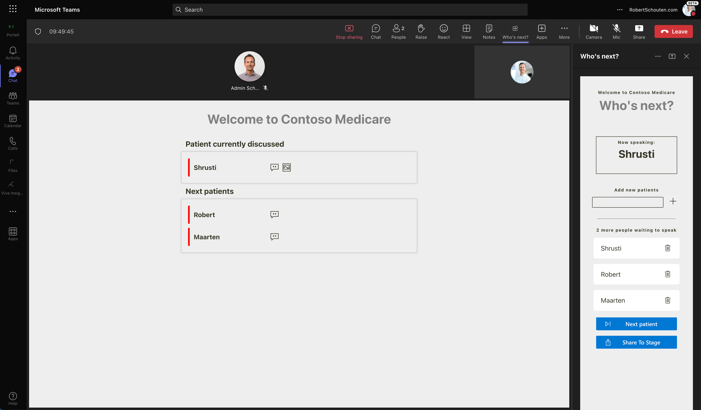
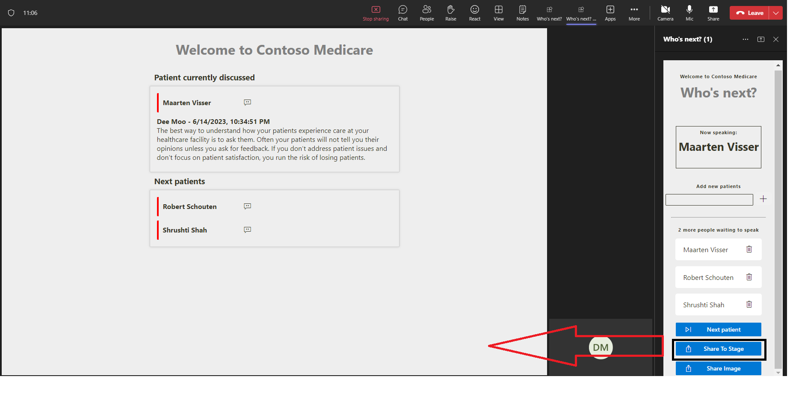
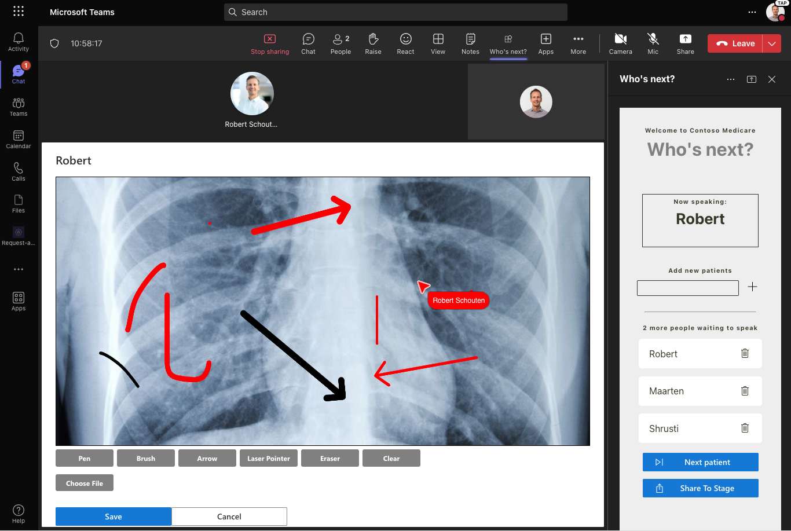

# How to use this Live Patient Review in-meeting app

## Summary

This application runs in the sidebar of a Teams meeting and assists in deciding who will speak next. Making these meetings not just PURE Physical and in SYNC, but also Hybrid and ASYNC. This allows specialists and docters with very little time, to contribute, even when they are temporary called away.

## Usecases
- The meeting organizer can add, remove, reorder patients to be discussed to the list (Fluid Container)
- The meeting organizer adds the specialists (doctors) who will provide feedback (Fluid Container)
- When joining a meeting specialists organiser can click on a button to open the Stage view to see an overview of all patients.
- Specialist (doctors) can add feedback per patient
- A specialist can upload an image using the live share canvas and Ink on the image, which will automatically been displayed for each attendee
- Each attendee can Ink on the uploaded image
- Every participant can go to 'presenter view' - "looking at the details of the currently discussed patient"
- LivePresence is used to lookup all meeting users and their role.
- Based on role, certain buttons are displayed only for organiser giving more control within the application.

This application illustrates the use of Teams Live Share SDK and the Fluid Framework. The Live Share SDK provides a secure connection to a Fluid Relay service hosted in Microsoft 365. Each instance of the service is isolated to the current meeting automatically. The Fluid Relay Service, along with the Fluid Framework SDK, synchronizes the list of names across everyone who is using the app. This is not screen sharing - it's keeping a JavaScript object structure in sync among all attendees, and a React user interface is displaying the data locally.

## The Problem Statement
MDC (MDO) meetings take play in a physical room.The meetings discusses a selection of patients, where current state is discussed, and change to be made: change of medication, surgery, discharge, etc. These meetings often discuses 4 to 6 patients and mostly take multible hours, and often have more then 10 people in the room.

One of the key challenges is that due to personal and work related emergencies, people might need to leave the room. Resulting in valuable (sometime patient safety impacting) next steps can't be captured.
What if doctors could stay on the meeting, while going to a emergency, and only have to temporary go out of the meeting.
This project was created as part of Hack Team Project.

So Microsoft 365 Cloud Consultants including Maarten Visser, Robert Schouten and Shrushti Shah came together to create application solving this problem statement for Specialists and docters by creating "Live Patient Review" teams meeting application

👀 Here is a quick look of how the app works!

⚙️They used [Teams Toolkit](https://learn.microsoft.com/en-us/microsoftteams/platform/toolkit/teams-toolkit-fundamentals?pivots=visual-studio-code), a VS Code extension to create their base teams app from a sample meeting app available in the toolkit itself.
Then they used [Fluid Framework](https://fluidframework.com/docs/) to synchronize the view for each attendee.

⚠️ If you can upload a Teams app, you can run this. It doesn't require any Azure AD permission or other administrative consent.

## Prerequisites

- [NodeJS](https://nodejs.org/en/) version as required by Teams Toolkit (v14 or v16 at the time of this sample)
- A Microsoft 365 tenant in which you have permission to upload Teams apps. Please don't develop in production; you can get a free Microsoft 365 developer tenant by joining the [Microsoft 365 developer program](https://developer.microsoft.com/en-us/microsoft-365/dev-program)
- [Teams Toolkit Visual Studio Code Extension](https://aka.ms/teams-toolkit)

## Version history

Version|Date|Author|Comments
-------|----|----|--------
1.0|June 15, 2023|Robert Schouten, Shrusti Shah and Maarten Visser|Using Live Share SDK created an application for Live Patient review which can be used by Specialist and docters to discuss patients using Live share canvas, give feedback etc.

## Disclaimer

**THIS CODE IS PROVIDED *AS IS* WITHOUT WARRANTY OF ANY KIND, EITHER EXPRESS OR IMPLIED, INCLUDING ANY IMPLIED WARRANTIES OF FITNESS FOR A PARTICULAR PURPOSE, MERCHANTABILITY, OR NON-INFRINGEMENT.**

---

## This demo illustrates

- Use of Teams Toolkit to create a simple meeting tab application
- Use of Live Share SDK to obtain a Fluid framework container
- Use of Fluid framework to synchronize the contents of a meeting tab among meeting attendees

## Try the sample with the Visual Studio Code extension

### Prepare a meeting

Follow the instructions to [create a meeting in Microsoft Teams](https://support.microsoft.com/office/create-a-meeting-in-teams-for-personal-and-small-business-use-eb571219-517b-49bf-afe1-4fff091efa85). Then in the Calendar you can find the meeting you just created. Double click the meeting will open the meeting details, and will enable the meeting app to be added in this meeting in later steps.

### Run the app locally

- Clone or download the repository to your local machine
- Ensure Teams Toolkit and a supported version of node are installed
- Within the "whos-next-meeting" folder, run `npm install` to install the developer and server-side dependencies
- In Visual Studio Code: Start debugging the project by hitting the `F5` key in your keyboard.
  - Alternatively open the `Run and Debug Activity` panel(Ctrl+Shift+D) in Visual Studio Code and click the `Run and Debug` green arrow button.
- The Teams web client will launch in your browser. Select `Add to a meeting`, then select the meeting you just created. (It may take a few minutes to appear on the list)
- Click `Set up a tab` in the next step, it will take you to the meeting configuration page.
- In the configuration page, click `Save`, this may take several minutes, and then you will see the meeting chat tab, however it will only display a message saying that you need to join the meeting in order to use it.
- Click `Join` to join the meeting.
- Select the tab (with a cartoon bubble logo and a default name of `Who's Next`) in the tab bar above the meeting scren. You will see a side panel tab in the meeting.

### Deploy the app to Azure

Deploy your project to Azure by following these steps:

- Open Teams Toolkit in Visual Studio Code, and sign in your Azure account by clicking the `Sign in to Azure` in the `ACCOUNTS` section from sidebar.
- After you signed in, select a subscription under your account. The Teams Toolkit will use this subscription to provision Azure resources to host you app.
- Open the Teams Toolkit and click `Provision in the cloud` in the `DEVELOPMENT` section.
  - Alternatively open the command palette(Ctrl+Shift+P) and type: `Teams: Provision in the cloud` command.
- Open the Teams Toolkit and click `Deploy to the cloud` in the `DEVELOPMENT` section.
  - Alternatively open the command palette(Ctrl+Shift+P) and type: `Teams: Deploy to the cloud` command.

> Note: Provisioning Azure cloud resources and deploying to Azure may cause charges to your Azure Subscription.

### Preview the app in Teams client

After you have completed the provision and deploy steps in `Deploy the app to Azure` section, you can preview your app in Teams client by following steps below:

- In Visual Studio Code

  1. Open the `Run and Debug Activity` panel from sidebar, or use short key Ctrl+Shift+D.
  1. Select `Launch Remote (Edge)` or `Launch Remote (Chrome)` in the launch configuration (a dropdown selection in the upper-left corner).
  1. Press the `Start Debugging` (small green arrow) button to launch your app, the Teams web client will be automatically opened in your browser, where you will see your app running remotely from Azure.

### Use in other tenants

This is a very simple application. It doesn't authenticate users, so the manifest works in any tenant. When you have a production deployment in Azure, you can use the same app package in any Microsoft 365 tenant where you have permission to upload or install it.

