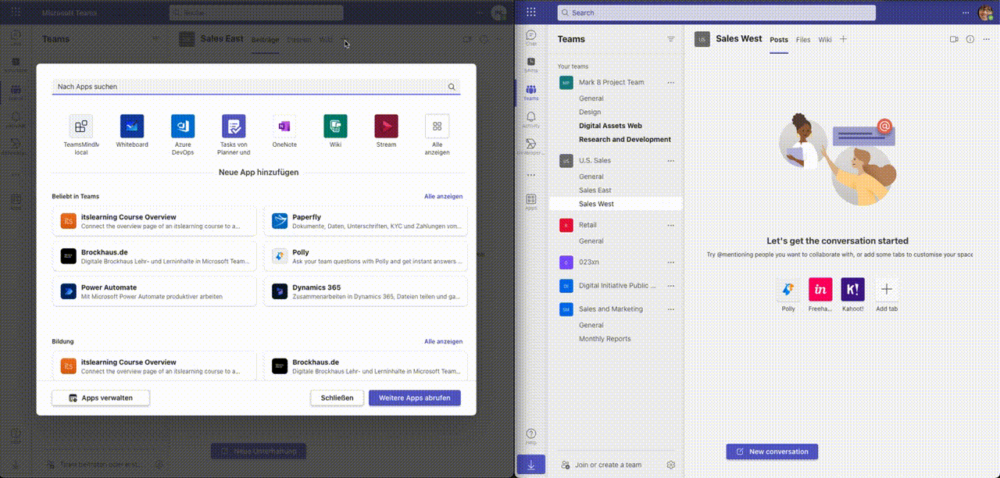

# MindMap based on Fluid

## Summary

Group Chat

Channel Tab

Meeting Tab (GO on Stage)


## Prerequisites

- [Node.js](https://nodejs.org/), supported versions: 16, 18
- An M365 account. If you do not have M365 account, apply one from [M365 developer program](https://developer.microsoft.com/microsoft-365/dev-program)
- [Set up your dev environment for extending Teams apps across Microsoft 365](https://aka.ms/teamsfx-m365-apps-prerequisites)
> Please note that after you enrolled your developer tenant in Office 365 Target Release, it may take couple days for the enrollment to take effect.
- [Teams Toolkit Visual Studio Code Extension](https://aka.ms/teams-toolkit) version 5.0.0 and higher or [TeamsFx CLI](https://aka.ms/teamsfx-cli)


## Getting Started

Follow below instructions to get started with this application template for local debugging.


### Use Azure Fluid Relay Service

Setup Your Azure Function and Deploy Azure function from Folder `APIC`
Setup Your Fluid Relay Service
Setup `config.ts`

```
const config = {
  FRS_local:false,
  FRS_TokenProviderURL:"https://yourAZFunction.azurewebsites.net/api/GetToken",
  FRS_TenantId: "your valid Guid",
  FRS_Endpoint:"https://eu.fluidrelay.azure.com"
};
```

### Local Fluid Relay Service
install 
```
npx @fluidframework/azure-local-service@latest
```
check `config.ts`

```
const config = {
  FRS_local:true,
};
```

## Version history

Version|Date|Author|Comments
-------|----|----|--------
1.0|July 3, 2023| [Peter Paul Kirschner](https://github.com/petkir) |Initial release

## Disclaimer

**THIS CODE IS PROVIDED *AS IS* WITHOUT WARRANTY OF ANY KIND, EITHER EXPRESS OR IMPLIED, INCLUDING ANY IMPLIED WARRANTIES OF FITNESS FOR A PARTICULAR PURPOSE, MERCHANTABILITY, OR NON-INFRINGEMENT.**

---


### Test your application with Visual Studio Code

1. Press `F5` or use the `Run and Debug Activity Panel` in Visual Studio Code.
1. Select a target Microsoft 365 application where the personal tabs can run: `Debug in Teams`, `Debug in Outlook` or `Debug in the Microsoft 365 app` and click the `Run and Debug` green arrow button.

### Test your application with TeamsFx CLI

1. Executing the command `teamsfx provision --env local` in your project directory.
1. Executing the command `teamsfx deploy --env local` in your project directory.
1. Executing the command `teamsfx preview --env local --m365-host <m365-host>` in your project directory, where options for `m365-host` are `teams`, `outlook` or `office`.

## References

* [Teams Toolkit Documentations](https://docs.microsoft.com/microsoftteams/platform/toolkit/teams-toolkit-fundamentals)
* [Teams Toolkit CLI](https://docs.microsoft.com/microsoftteams/platform/toolkit/teamsfx-cli)
* [TeamsFx SDK](https://docs.microsoft.com/microsoftteams/platform/toolkit/teamsfx-sdk)
* [Teams Toolkit Samples](https://github.com/OfficeDev/TeamsFx-Samples)
